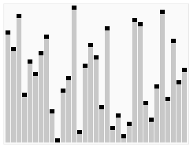

**Алгоритмы сортировок**

***1. Сортировка пузырьком (Bubble sort)***

Последовательно сравниваются значения друг с другом. Если следующее больше предудущего, то они меняются местами. При
полном прохождении списка, все начинается снова с первого элемента. И так повроряется, пока число перемещений элементов
за проход не будет равно 0.

**Простые сортировки**

***2. Сортировка вставками (Insertion sort)***

Список с элементами перебирается слева направо. При этом каждый последующий элемент размещается так, чтобы он оказался
между ближайшими элементами с минимальным и максимальным значением.

***3. Сортировка выбором (selection sort)***

Сначала нужно рассмотреть подмножество массива и найти в нём максимум (или минимум). Затем выбранное значение меняют
местами со значением первого неотсортированного элемента. Этот шаг нужно повторять до тех пор, пока в массиве не
закончатся неотсортированные подмассивы.

**Эффективные сортировки**

***4. Быстрая сортировка (Quick sort)***

Этот алгоритм состоит из трёх шагов. Сначала из массива нужно выбрать один элемент — его обычно называют опорным. Затем
другие элементы в массиве перераспределяют так, чтобы элементы меньше опорного оказались до него, а большие или равные —
после. А дальше рекурсивно применяют первые два шага к подмассивам справа и слева от опорного значения.

Быструю сортировку изобрели в 1960 году для машинного перевода: тогда словари хранились на магнитных лентах, а
сортировка слов обрабатываемого текста позволяла получить переводы за один прогон ленты, без перемотки назад.

***5. Сортировка слиянием (Merge sort)***

Сортировка слиянием пригодится для таких структур данных, в которых доступ к элементам осуществляется последовательно (
например, для потоков). Здесь массив разбивается на две примерно равные части и каждая из них сортируется по
отдельности. Затем два отсортированных подмассива сливаются в один.

***6. Пирамидальная сортировка (Heap sort)***

При этой сортировке сначала строится пирамида из элементов исходного массива. Пирамида (или двоичная куча) — это способ
представления элементов, при котором от каждого узла может отходить не больше двух ответвлений. А значение в
родительском узле должно быть больше значений в его двух дочерних узлах.

Пирамидальная сортировка похожа на сортировку выбором, где мы сначала ищем максимальный элемент, а затем помещаем его в
конец. Дальше нужно рекурсивно повторять ту же операцию для оставшихся элементов.